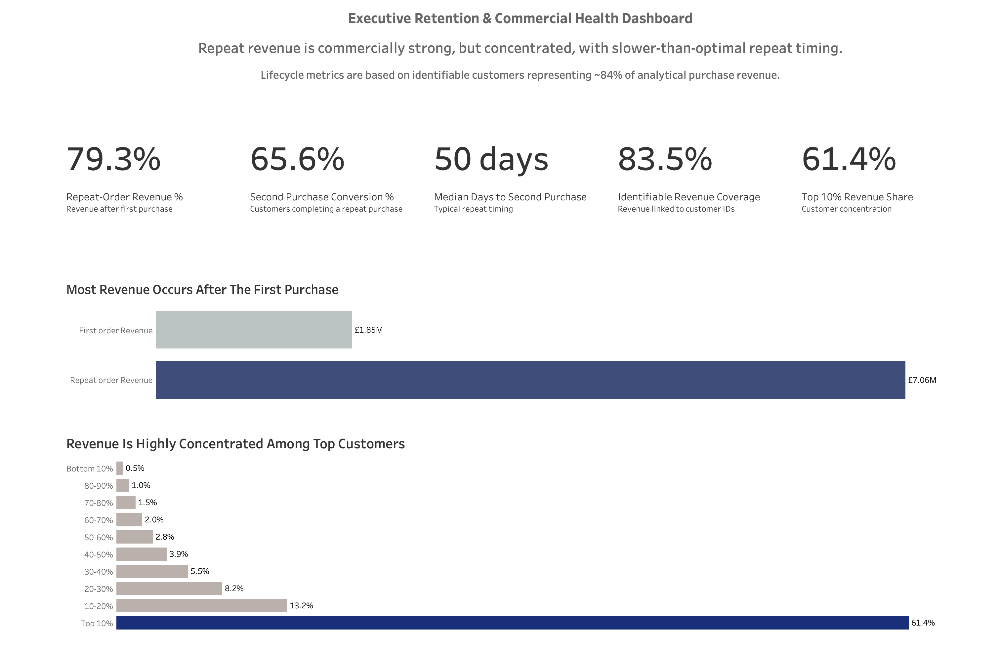

# Commercial Retention Analysis

End-to-end customer retention, lifecycle analytics, predictive CRM prioritisation, and commercial decision-support simulation for a DTC-style ecommerce business.

This project uses the UCI Online Retail dataset to simulate a real commercial analytics workflow: transaction cleaning, KPI governance, retention analysis, cohort reporting, customer concentration analysis, CRM experiment design, incrementality simulation, predictive ML, and dashboard-ready customer action scoring.

The default project baseline uses the one-year UCI Online Retail workbook. The repo also supports an expanded two-year Online Retail II CSV as a separate robustness test.

## Executive Takeaway

Repeat behaviour is commercially powerful, but revenue is concentrated and repeat timing is slower than ideal. The best commercial opportunity is not broad discounting. It is targeted lifecycle intervention: accelerate second purchase for eligible one-time buyers, protect high-value customers at lapse risk, and validate CRM value through controlled experiments.



## Business Questions

This project answers:

- How clean and usable is the transaction data for customer analytics?
- How much revenue is identifiable at customer level?
- Are customers coming back, and how quickly?
- How dependent is revenue on repeat behaviour?
- How concentrated is revenue among high-value customers?
- Which customers should CRM prioritise?
- Can predictive analytics support retention action planning?
- How should the business measure incremental CRM value?

## Key Findings

Current regenerated outputs show:

| Metric | Value |
| --- | ---: |
| Total rows analysed | 541,909 |
| Duplicate rows identified | 5,268 |
| Missing CustomerID rows | 24.9% |
| Gross positive purchase revenue | GBP 10.67M |
| Net transactional revenue | GBP 9.77M |
| Identifiable customer revenue | GBP 8.91M |
| Identifiable revenue coverage | 83.5% |
| Valid customers | 4,338 |
| Valid orders | 18,532 |
| Second purchase conversion | 65.6% |
| Median days to second purchase | 50 days |
| Repeat-order revenue share | 79.3% |
| Repeat-customer revenue share | 93.1% |
| Top 10% revenue share | 61.4% |

Interpretation:

- Repeat customers drive the majority of identifiable revenue.
- Customers do return, but repeat timing is slower than ideal.
- Revenue is materially concentrated in a small high-value segment.
- CRM should focus on lifecycle acceleration, lapse prevention, and controlled incrementality measurement.

## Predictive Analytics

The project contains two ML layers.

### Second Purchase Propensity

Purpose:

- Predict whether a first-time buyer will make a second purchase within 60 days.
- Support early lifecycle CRM prioritisation.

Current selected model:

- Histogram gradient boosting.

Current test performance:

| Metric | Value |
| --- | ---: |
| ROC-AUC | 0.520 |
| PR-AUC | 0.391 |
| Test repeat rate | 36.7% |
| Top 10% precision | 44.0% |
| Top 20% precision | 40.0% |
| Top decile lift | 1.20x |

Interpretation:

- Directionally useful for CRM prioritisation.
- Not strong enough to be a standalone production targeting engine.
- Should be validated through exposed vs control CRM testing.

### Lapse Risk Model

Purpose:

- Predict whether an existing customer will have no valid purchase in the next 90 days.
- Support retention prioritisation and high-value lapse prevention.

Current selected model:

- Histogram gradient boosting.

Current test performance:

| Metric | Value |
| --- | ---: |
| ROC-AUC | 0.753 |
| PR-AUC | 0.690 |
| Test lapse rate | 47.3% |
| Top 10% precision | 75.8% |
| Top 20% precision | 73.8% |
| Top decile lift | 1.60x |

Interpretation:

- This is the strongest ML layer in the project.
- It creates a credible predictive retention risk signal.
- It should be used to prioritise CRM intervention, especially for high-value high-risk customers.

## CRM Priority Output

The final operational layer combines lifecycle segments, lapse-risk scores, second-purchase propensity, and customer value into a CRM priority table.

| CRM Priority Group | Customers | Revenue Share | Recommended Action |
| --- | ---: | ---: | --- |
| P1 High-Value Lapse Prevention | 22 | 4.5% | Personalised retention intervention |
| P2 High-Value Watchlist | 24 | 2.4% | VIP nurture |
| P3 Second Purchase Acceleration | 515 | 2.4% | Day 21 second purchase accelerator |
| P4 Standard Lapse Prevention | 1,281 | 8.1% | Automated reactivation |
| P5 Standard Nurture | 714 | 7.0% | Low-cost nurture |
| P6 Winback Pool | 291 | 3.9% | Selective winback |
| P7 Standard Lifecycle | 1,491 | 71.6% | Standard messaging |

Key operational insight:

> A small P1 group contains only 22 customers but represents 4.5% of revenue and has high predicted lapse risk. This is the clearest high-touch retention priority.

## Methodology

The project workflow is organised into seven core notebooks plus one Tableau export notebook:

| Notebook | Purpose |
| --- | --- |
| `01_data_cleaning.ipynb` | Raw transaction audit, cleaning, revenue flags, processed transaction layer |
| `02_retention_analysis.ipynb` | Customer metrics, lifecycle revenue, cohorts, concentration analysis |
| `03_incrementality_simulation.ipynb` | CRM economics, cannibalisation, break-even uplift, net incremental value |
| `04_customer_segmentation.ipynb` | Lifecycle segments and CRM action mapping |
| `05_second_purchase_propensity_model.ipynb` | First-order customer propensity to repeat within 60 days |
| `06_lapse_risk_model.ipynb` | Rolling-snapshot 90-day lapse risk model |
| `07_crm_priority_scoring.ipynb` | Combined customer action priority layer |
| `08_dataset_comparison.ipynb` | Compares the one-year baseline with the expanded two-year dataset |
| `09_v2_year_over_year_comparison.ipynb` | Compares prior-year vs current-year behaviour inside the expanded dataset |
| `03_tableau_exports.ipynb` | Legacy BI export layer for Tableau-ready executive dashboard CSVs |

Reusable source modules support the core pipeline:

| Module | Purpose |
| --- | --- |
| `src/config.py` | Dataset paths and versioned configuration |
| `src/data_loading.py` | Raw Excel/CSV loading and canonical column mapping |
| `src/cleaning.py` | Transaction flags, revenue audit, clean transaction output |
| `src/customer_metrics.py` | Customer orders, lifecycle metrics, deciles, retention cohorts |
| `src/validation.py` | Output schema, revenue reconciliation, customer metric checks |
| `src/run_pipeline.py` | Command-line runner for the reusable core pipeline |

## Architecture

The project is structured as a layered analytics application:

| Layer | Role |
| --- | --- |
| Raw data | Source retail transaction workbooks/CSVs in `data/raw/` |
| Cleaning layer | Canonical transaction schema, revenue flags, data quality audit |
| Metrics layer | Customer orders, lifecycle revenue, retention cohorts, concentration outputs |
| ML layer | Second-purchase propensity and 90-day lapse-risk prioritisation notebooks |
| CRM priority layer | Value, lifecycle, risk, and propensity combined into customer action groups |
| Reports/dashboard layer | Markdown reports, Tableau-ready exports, and dashboard documentation |

The notebooks remain the storytelling and modelling layer. The reusable `src/` modules hold the core data loading, cleaning, metric generation, and validation logic so the project can be run as a repeatable pipeline.

SQL parity is provided for core retention logic:

| SQL File | Purpose |
| --- | --- |
| `sql/customer_metrics.sql` | Customer-level order, revenue, AOV, repeat-customer metrics |
| `sql/customer_concentration.sql` | Customer revenue deciles and top-decile concentration |
| `sql/retention_cohorts.sql` | Long-form monthly retention cohort output |

## Core Outputs

Key processed outputs include:

- `data/processed/clean_transactions.parquet`
- `data/processed/data_audit_summary.csv`
- `data/processed/customer_metrics.parquet`
- `data/processed/customer_lifecycle_revenue_split.csv`
- `data/processed/customer_revenue_deciles.csv`
- `data/processed/retention_matrix.csv`
- `data/processed/customer_segments.csv`
- `data/processed/customer_segment_summary.csv`
- `data/processed/incrementality_scenarios.csv`
- `data/processed/second_purchase_propensity_scores.csv`
- `data/processed/lapse_risk_scores.csv`
- `data/processed/crm_customer_priority_scores.csv`
- `data/processed/crm_priority_summary.csv`

Note: `data/raw/` and `data/processed/` are intentionally ignored by Git. Recreate the processed outputs locally by running the notebooks after placing the raw workbook in `data/raw/`.

Tracked BI export examples are available in `data/bi_exports/` for dashboard review.

## Reports

The project includes stakeholder-ready reports:

- `reports/stakeholder_summary.md`
- `reports/kpi_definitions.md`
- `reports/crm_experiment_design.md`
- `reports/incrementality_simulation_summary.md`
- `reports/customer_segmentation_strategy.md`
- `reports/ml_second_purchase_propensity_summary.md`
- `reports/ml_lapse_risk_summary.md`
- `reports/crm_priority_strategy.md`
- `reports/dataset_comparison_summary.md`
- `reports/v2_year_over_year_comparison.md`
- `reports/final_project_summary.md`

## Dashboarding

Dashboard documentation:

- `docs/dashboard_standards.md`
- `docs/dashboard_data_dictionary.md`

Dashboard screenshot:

- `dashboards/dashboard_executive_overview.png`

Recommended dashboard pages:

- Executive Overview
- Revenue and Retention
- Customer Concentration
- Cohort Retention
- Customer Segments
- Predictive ML
- CRM Priority Actions

The most important dashboard story is:

> Repeat revenue is strong, but concentrated. CRM should prioritise high-value lapse prevention and second-purchase acceleration, then validate impact through controlled testing.

## Tech Stack

- Python
- pandas
- scikit-learn
- DuckDB
- SQL
- Jupyter Notebooks
- Tableau Public or BI dashboarding
- Git/GitHub

## How To Reproduce

1. Create and activate a virtual environment.

```bash
python3 -m venv .venv
source .venv/bin/activate
```

2. Install dependencies.

```bash
pip install -r requirements.txt
```

3. Download the UCI Online Retail workbook and place it here:

```text
data/raw/Online Retail.xlsx
```

Optional expanded dataset for comparison:

```text
data/raw/online_retail_II.csv
```

4. Run the notebooks in this order:

```text
notebooks/01_data_cleaning.ipynb
notebooks/02_retention_analysis.ipynb
notebooks/03_incrementality_simulation.ipynb
notebooks/04_customer_segmentation.ipynb
notebooks/05_second_purchase_propensity_model.ipynb
notebooks/06_lapse_risk_model.ipynb
notebooks/07_crm_priority_scoring.ipynb
```

5. Optional: run `notebooks/03_tableau_exports.ipynb` to regenerate tracked BI export CSVs in `data/bi_exports/`.

6. Optional: run the expanded dataset comparison.

```bash
RAW_PATH="$(pwd)/data/raw/Online Retail.xlsx" PROCESSED_DIR="$(pwd)/data/processed/v1_online_retail" .venv/bin/jupyter nbconvert --execute --to notebook --output /tmp/v1_01_data_cleaning.ipynb notebooks/01_data_cleaning.ipynb
RAW_PATH="$(pwd)/data/raw/online_retail_II.csv" PROCESSED_DIR="$(pwd)/data/processed/v2_online_retail_ii" .venv/bin/jupyter nbconvert --execute --to notebook --output /tmp/v2_01_data_cleaning.ipynb notebooks/01_data_cleaning.ipynb
```

Then run notebooks `02` through `07` again for each `PROCESSED_DIR`, followed by `notebooks/08_dataset_comparison.ipynb` and `notebooks/09_v2_year_over_year_comparison.ipynb`.

The comparison treats V2 as an expanded two-year history, not as an independent validation dataset. V2 contains the full V1 baseline plus an earlier year.

The year-over-year extension splits V2 into prior-year and current-year periods to test whether retention behaviour, concentration, and lifecycle timing are stable across trading years.

Reusable pipeline runner:

```bash
python -m src.run_pipeline --dataset v1
python -m src.run_pipeline --dataset v2
```

The runner regenerates the reusable core outputs for the selected dataset: clean transactions, audit summary, customer metrics, lifecycle revenue split, revenue deciles, and retention matrix. The ML/CRM notebooks remain available for model training, scoring, and executive analysis.

Run lightweight tests:

```bash
python -m unittest discover -s tests
```

Command-line execution example:

```bash
.venv/bin/jupyter nbconvert --execute --to notebook --output /tmp/01_data_cleaning_executed.ipynb notebooks/01_data_cleaning.ipynb
```

Repeat the command for each notebook in sequence, updating the input and output notebook names.

## Dataset Context

This project uses the UCI Online Retail dataset as a public simulation.

Limitations:

- No acquisition channel data.
- No email or CRM exposure data.
- No customer demographics.
- No true campaign treatment/control data.
- Product taxonomy is limited.
- Findings should be interpreted directionally, not as production business benchmarks.

The project intentionally emphasises commercial analytics reasoning, KPI governance, predictive prioritisation, experimentation discipline, and executive communication.

## Strategic Recommendation

Use the analytics stack to operate CRM with discipline:

1. Protect high-value customers with high predicted lapse risk.
2. Run the second-purchase accelerator for eligible one-time buyers.
3. Use automated reactivation for standard-value high-risk customers.
4. Avoid broad discounting for low-risk customers.
5. Validate CRM impact through exposed vs holdout measurement before scaling.

One-line recommendation:

> Move from broad retention messaging to risk-, value-, and lifecycle-specific CRM actions measured through incrementality discipline.
